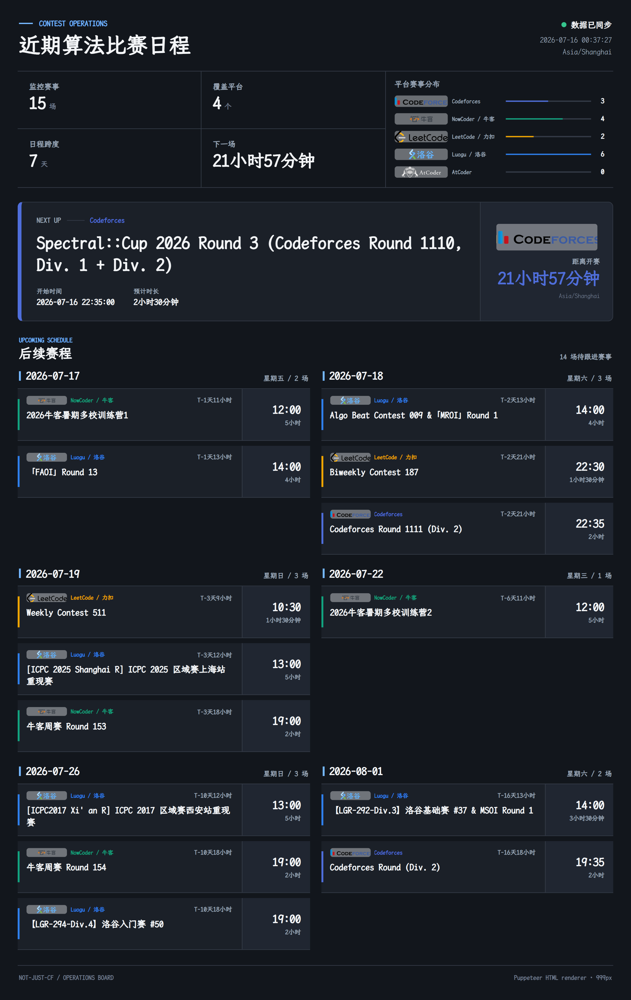
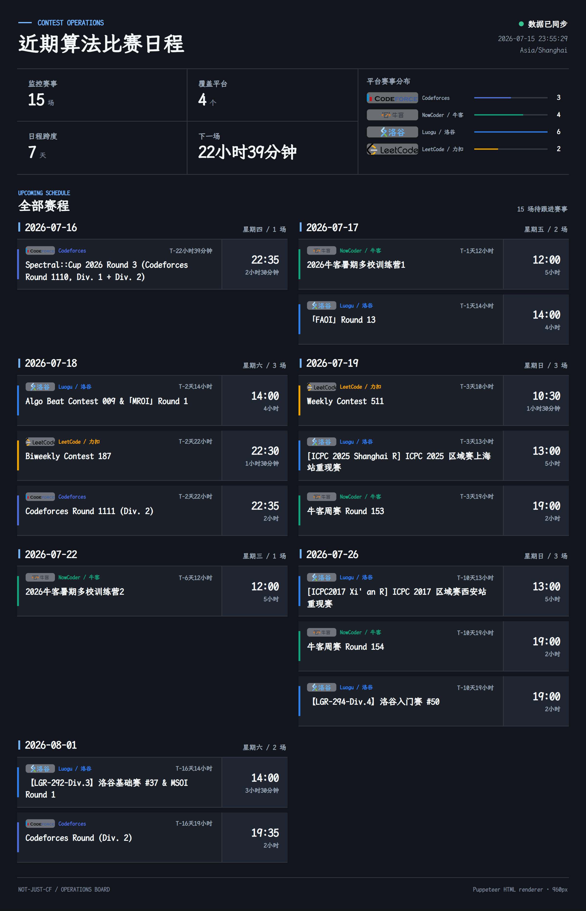

> 推荐前往 [GitHub](https://github.com/VincentZyuApps/koishi-plugin-not-just-cf-vincentzyu-fork) 或 [Gitee](https://gitee.com/vincent-zyu/koishi-plugin-not-just-cf-vincentzyu-fork) 阅读 README，获得更佳体验。


# 📅 koishi-plugin-not-just-cf-vincentzyu-fork

[](https://www.npmjs.com/package/koishi-plugin-not-just-cf-vincentzyu-fork)
[](https://www.npmjs.com/package/koishi-plugin-not-just-cf-vincentzyu-fork)
[](https://opensource.org/license/mit)

[](https://github.com/VincentZyuApps/koishi-plugin-not-just-cf-vincentzyu-fork)
[](https://gitee.com/vincent-zyu/koishi-plugin-not-just-cf-vincentzyu-fork)

[](https://forum.koishi.xyz/t/topic/xxxxx)
[](https://qm.qq.com/q/ZN7fxZ3qCq)

[](https://www.typescriptlang.org/)
[](https://pptr.dev/)
[](https://github.com/kane50613/takumi)

聚合 **Codeforces、NowCoder、LeetCode、Luogu、AtCoder** 的 Koishi 多平台算法赛事助手，支持近期日程查询、每日与赛前提醒、QQ Markdown 交互，以及 Takumi 和 Puppeteer 双引擎图片输出。

## ✨ 功能特性

- 🏁 同时获取五个算法比赛平台的近期赛事，并支持按平台查询。
- 📅 可配置未来比赛窗口，设置为 `0` 时返回所有未来比赛。
- ⏰ 支持 Cron 每日提醒与赛前指定分钟提醒，可发送到多个 Bot 和频道。
- 📄 支持文字列表、Takumi WASM 图片、Puppeteer HTML 运营看板等多种输出。
- 🐧 适配 QQ 官方 Bot Markdown，提供引用块、表格和平台快捷按钮。
- 🎨 Puppeteer 看板包含平台 Logo、双语名称、赛事统计、焦点赛事与日期时间轴。
- 🔤 自动下载并完整校验 LXGW 文楷字体，优先 Gitee，失败后回退 GitHub。
- 🐛 可将各平台最后一次完整响应写入文件，便于排查上游接口变化。

## ⚠️ 服务依赖

| 服务 | 要求 | 用途 |
|---|---|---|
| `http` | 必需 | 获取比赛数据与下载字体 |
| `puppeteer` | 可选 | 使用 `puppeteer_image` 输出运营看板 |
| `cron` | 可选 | 每日定时比赛提醒 |

未启用 Puppeteer 时，文字、Takumi 和 QQ Markdown 输出仍可正常使用。

## 📦 安装

推荐在 Koishi 插件市场搜索 `not-just-cf-vincentzyu-fork` 安装，也可以使用包管理器：

```bash
npm install koishi-plugin-not-just-cf-vincentzyu-fork
```

## 🚀 命令

| 命令 | 别名 | 说明 |
|---|---|---|
| `contest.all` | `all`、`contest-all` | 查看全部已启用平台的近期比赛 |
| `contest.list <平台>` | `list`、`contest-list` | 查看指定平台的近期比赛 |

平台参数如下：

| 参数 | 平台 |
|---|---|
| `cf` | Codeforces |
| `nc` | NowCoder / 牛客 |
| `lc` | LeetCode / 力扣 |
| `lg` | Luogu / 洛谷 |
| `atc` | AtCoder |

示例：

```text
contest.all
contest.list cf
contest.list nc
```

## 📤 输出模式

`outputFormats` 支持多选，并按照插件内置顺序依次发送：

| 配置值 | 输出 |
|---|---|
| `text` | 带 emoji 的文字比赛列表 |
| `takumi_image` | 简洁稳定的 Takumi WASM 图片 |
| `puppeteer_image` | 带平台 Logo、统计和焦点赛事的 HTML 运营看板 |
| `qqmarkdown_style` | QQ 官方 Bot 引用块详情与按钮 |
| `qqmarkdown_table` | QQ 官方 Bot Markdown 表格与按钮 |

## 🖼️ 图片输出预览

### Puppeteer HTML/CSS 运营看板（`puppeteer_image`）



### Takumi WASM 简洁模式（`takumi_image`）



## 🔧 常用配置

| 配置项 | 默认值 | 说明 |
|---|---:|---|
| `enabledOjs` | 五个平台 | 启用的比赛平台 |
| `contestWindowDays` | `30` | 获取未来几天内的比赛，`0` 表示所有未来比赛 |
| `outputFormats` | `["puppeteer_image", "qqmarkdown_table"]` | 默认输出格式，可多选 |
| `textMaxDisplay` | `25` | 文字模式最多显示的比赛数量 |
| `takumiImageMaxDisplay` | `50` | Takumi 图片最多显示的比赛数量 |
| `takumiImageWidth` | `999` | Takumi 图片宽度 |
| `takumiImageDarkMode` | `true` | Takumi 图片是否使用深色模式 |
| `takumiImageFontPath` | 空 | Takumi 自定义字体；留空自动使用 LXGW 文楷 |
| `takumiShowRenderInfo` | `false` | Takumi 图片发送后附加渲染耗时 |
| `puppeteerImageMaxDisplay` | `50` | Puppeteer 图片最多显示的比赛数量 |
| `puppeteerSpotlightMaxContests` | `100` | 比赛总数不超过该值时，单独突出显示最近一场比赛 |
| `puppeteerImageWidth` | `999` | Puppeteer 图片宽度 |
| `puppeteerDeviceScaleFactor` | `2.5` | Puppeteer 截图设备像素比，越高越清晰但图片体积越大 |
| `puppeteerImageDarkMode` | `true` | Puppeteer 图片是否使用深色模式 |
| `puppeteerImageFontPath` | 空 | Puppeteer 自定义字体；留空自动使用 LXGW 文楷 |
| `puppeteerShowRenderInfo` | `false` | Puppeteer 图片发送后附加渲染耗时 |
| `qqMarkdownMaxDisplay` | `50` | QQ Markdown 最多展开的比赛数量 |
| `alertEnabled` | `false` | 启用 Cron 每日提醒 |
| `alertBeforeEnabled` | `false` | 启用赛前提醒 |
| `alertBeforeMinutes` | `30` | 提前多少分钟提醒 |
| `verboseConsoleLog` | `false` | 控制台输出详细日志 |
| `verboseFileLog` | `false` | 保存各平台最后一次完整响应文件 |

完整配置请在 Koishi 控制台插件配置页面查看。

## 🔤 字体与调试文件

图片模式会自动检查 `LXGWWenKaiMono-Regular.ttf`，并下载到 Koishi 根目录的 `data/fonts`。下载完成后会校验文件大小及 `md5 / sha1 / sha256 / sha512`。

开启 `verboseFileLog` 后，完整响应写入：

```text
<ctx.baseDir>/cache/not-just-cf-vincentzyu-fork/
├─ latest-codeforces.json
├─ latest-atcoder.json
├─ latest-nowcoder.json
├─ latest-leetcode.json
└─ latest-luogu.json
```

控制台仅输出请求摘要，不会打印完整原始响应。

## 💬 交流反馈

- [GitHub Issues](https://github.com/VincentZyuApps/koishi-plugin-not-just-cf-vincentzyu-fork/issues)
- [Gitee Issues](https://gitee.com/vincent-zyu/koishi-plugin-not-just-cf-vincentzyu-fork/issues)
- [Koishi 论坛（ID 暂定）](https://forum.koishi.xyz/t/topic/xxxxx)
- QQ 群：`1085190201`

## 🙏 致谢

感谢 [FaulknerWu](https://github.com/FaulknerWu) 等贡献者提供和维护比赛数据抓取实现，也感谢 Koishi、Takumi、Puppeteer、Cheerio、Axios 与 LXGW 文楷等开源项目。

## 📜 许可证

本项目基于 [MIT License](https://opensource.org/license/mit) 开源。
